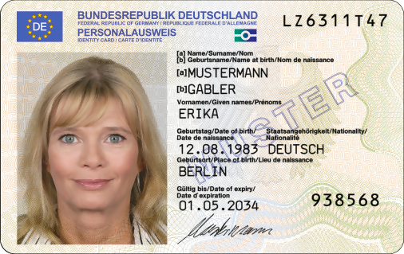
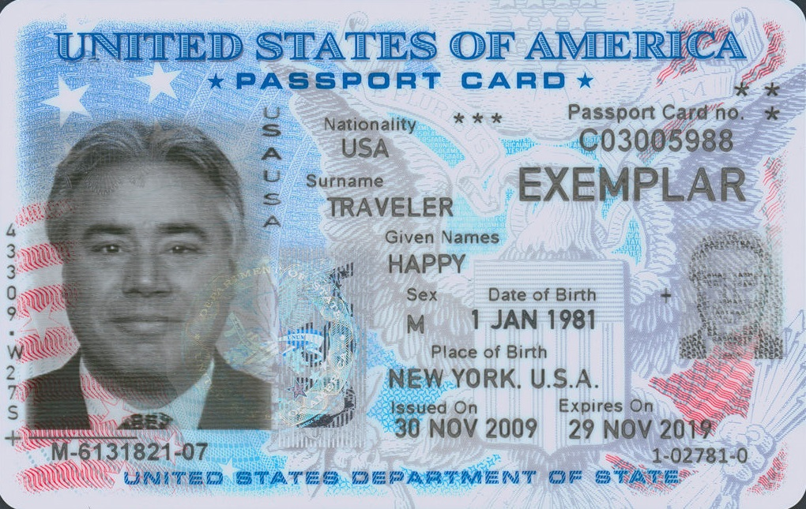

# Development Notes

## Architecture

- `main.go` owns CLI parsing and orchestration only.
- `internal/layout` owns physical page placement and is covered by unit tests.
- `pdfgen` owns backend-specific PDF generation behind the `Generator` interface.
- `internal/version` owns build and backend dependency version reporting.

## Layout Decisions

- Horizontal centering intentionally centers the full grid block, not the currently populated partial row or partial page.
- Repeated `-gap` values are applied cyclically between columns.
- Default normal mode keeps the historical alternating vertical gap of `5/10 mm`.
- If `-vgap` is explicitly supplied in normal mode, the supplied value is used as a fixed vertical gap.
- Side-by-side mode always uses two columns.

## Backend Differences

- The project supports several Go PDF backends behind the same `Generator` interface.
- Default backend: [`pdfcpu`](https://github.com/pdfcpu/pdfcpu). Build normally with `go build`.
- Alternative backend: [`fpdf`](https://codeberg.org/go-pdf/fpdf). Build with `go build -tags fpdf`.
- Experimental generation-only backends:
  - [`gopdf`](https://github.com/signintech/gopdf), built with `go build -tags gopdf`.
  - [`gofpdf`](https://github.com/phpdave11/gofpdf), built with `go build -tags gofpdf`.
  - [`canvas`](https://github.com/tdewolff/canvas), built with `go build -tags canvas`.
- The default `pdfcpu` backend supports PDF inputs, wildcard expansion, image XObject source-name metadata, and `cardsheet extract`.
- The `fpdf`, `gopdf`, `gofpdf`, and `canvas` backends support image-to-PDF generation only. They reject PDF inputs and `cardsheet extract`.
- `fpdf`, `gopdf`, `gofpdf`, and `canvas` center images inside the requested rectangle while preserving aspect ratio.
- `pdfcpu` uses high-level image boxes and fits image content into the requested rectangle while preserving aspect ratio.
- `pdfcpu` coordinates are converted from millimetres to PDF points before passing data to `api.Create`.
- `pdfcpu` uses `LowerLeft` origin, so y coordinates are translated from the CLI's top-left layout model.
- Page layout coordinates are shared between backends, but image content inside each card rectangle may differ slightly because of backend rendering behavior.
- All backends overwrite an existing `-out` target.

## Validation

- The CLI validates that every input file can be opened and decoded before creating the generator.
- JPEG and PNG are enabled via blank imports in `main.go`.
- Unsupported or unreadable images fail early with an `input error`.

## DPI Limiting

- `-dpi` limits embedded image pixel dimensions based on the fixed card rectangle, reducing PDF size while preserving printed dimensions.
- It does not change PDF page DPI; PDF placement still uses physical dimensions.
- Effective DPI is calculated as `image pixels / printed card inches`.
- `-verbose` prints original effective DPI and, when `-dpi` is active, output dimensions and byte-size change.
- Without `-dpi`, `-verbose` only reports current effective DPI and highlights images below 300 DPI.
- Downsampled images are written to temporary files and deleted after PDF generation.
- If a downsampled candidate is not smaller than the original encoded image, the original file is kept.
- Source-name metadata always stores the original input basename, even when the image was downsampled into a temporary file before PDF generation.

## PDF Roundtrip

- PDF roundtrip behavior is supported in the default Go build.
- The `pdfcpu` generator writes `/CardsheetSourceFilename` into each image XObject after creating the PDF.
- Only the basename is stored, never the full source path.
- `cardsheet extract [--out-dir DIR] [--overwrite | --rename] input.pdf` extracts all images from all pages, including arbitrary external PDFs.
- If `/CardsheetSourceFilename` exists, extraction uses that basename.
- For external PDFs without this metadata, extraction falls back to `<pdf-base><N>.<ext>`.
- In interactive mode, conflicts prompt with path, modification time, and size. In non-interactive mode, conflicts require `--overwrite` or `--rename`.
- PDF inputs are limited to PDFs previously created by this utility. They are expanded into temporary image files before validation and layout, preserving argument order.
- The PDF input path rejects PDFs with image XObjects missing `/CardsheetSourceFilename`; `extract` keeps accepting those PDFs via fallback names.
- Wildcard expansion happens before validation and sorts matches lexicographically.
- Generation-only backend builds reject `extract` and PDF inputs with `unsupported feature: rebuild with the default pdfcpu backend`.

## Build Tags

- Default build uses the `pdfcpu` backend.
- `go build -tags fpdf` uses the `fpdf` backend.
- `go build -tags gopdf`, `go build -tags gofpdf`, and `go build -tags canvas` use experimental generation-only backends.
- Build tags are intended to be mutually exclusive; combining backend tags is not supported.
- Backend variants should pass tests:

```sh
go test ./...
go test -tags fpdf ./...
go test -tags gopdf ./...
go test -tags gofpdf ./...
go test -tags canvas ./...
```

Smoke-test generation with local sample files:

```sh
go run . -out cards.pdf card1.jpg card2.jpg
go run -tags fpdf . -out cards.pdf card1.jpg card2.jpg
go run -tags gopdf . -out cards.pdf card1.jpg card2.jpg
go run -tags gofpdf . -out cards.pdf card1.jpg card2.jpg
go run -tags canvas . -out cards.pdf card1.jpg card2.jpg
```

Release-style size checks use stripped binaries with `-ldflags="-s -w"`:

| Backend | Build command | Stripped binary | Dependency count |
|---------|---------------|----------------:|-----------------:|
| `pdfcpu` | `go build -ldflags="-s -w"` | 10.69 MiB | 265 |
| `fpdf` | `go build -tags fpdf -ldflags="-s -w"` | 3.28 MiB | 135 |
| `gopdf` | `go build -tags gopdf -ldflags="-s -w"` | 3.00 MiB | 136 |
| `gofpdf` | `go build -tags gofpdf -ldflags="-s -w"` | 3.38 MiB | 135 |
| `canvas` | `go build -tags canvas -ldflags="-s -w"` | 6.49 MiB | 360 |

The experimental `gopdf` binary is the smallest measured variant. `gofpdf` is close to `fpdf`. `canvas` has a smaller binary than the default build but the largest dependency graph in this experiment.

## Examples

The repository includes public-domain specimen cards for trying the layout modes:

| German ID card | U.S. passport card |
|----------------|--------------------|
|  |  |

Generate a default top-to-bottom layout:

```sh
cardsheet -out examples/output/default.pdf examples/input/de-id-front.png examples/input/de-id-back.png examples/input/us-passport-card-front.jpg examples/input/us-passport-card-back.jpg
```

Generate a two-column side-by-side layout:

```sh
cardsheet -side-by-side -out examples/output/side-by-side.pdf examples/input/de-id-front.png examples/input/de-id-back.png examples/input/us-passport-card-front.jpg examples/input/us-passport-card-back.jpg
```

The README layout thumbnails are generated from the same example images and layout coordinates:

- `examples/output/default.png`
- `examples/output/side-by-side.png`

See [examples/SOURCES.md](examples/SOURCES.md) for image sources and licensing notes.

## Platforms

- The code should build on Windows, Linux, and macOS.
- Common target architectures are amd64 and arm64.
- Cross-compilation uses standard Go environment variables:

```sh
GOOS=linux GOARCH=amd64 go build
```

## Python Version

- `cardsheet.py` is a Python implementation of the same layout rules.
- It uses [ReportLab](https://www.reportlab.com/dev/docs/) canvas APIs and draws images into A4 pages.
- By default it preserves image aspect ratio inside each card rectangle.
- Use `-stretch` to fill each card rectangle in the Python prototype.
- It declares its Python dependencies inline using script metadata.
- Run it with `uv run`; `uv` creates and manages the script environment.
- It supports the same core CLI options as the Go version: `-out`, `-gap`, `-vgap`, `-dpi`, `-verbose`, `-side-by-side`, and `-version`.
- It also supports `extract`, PDF input, wildcard expansion, and `/CardsheetSourceFilename` metadata using [pypdf](https://pypdf.readthedocs.io/).
- Image validation, effective-DPI reporting, and optional downsampling are implemented with [Pillow](https://python-pillow.org/).
- Unsupported or unreadable images fail with an `input error`, matching the Go CLI behavior.

```sh
uv run cardsheet.py -out cards.pdf card1.jpg card2.jpg
```

Run Python-only tests with the standard library test runner:

```sh
python -m unittest discover -s tests
```

## Version Reporting

- `AppVersion` can be injected via `-ldflags "-X main.AppVersion=..."`.
- Without an injected version, build info is used: module version first, then short VCS revision, then `local`.
- Dirty VCS builds are marked with `+dirty`.
- Backend dependency versions are resolved by exact module path.

## Known Follow-ups

- Add golden or visual regression tests for generated PDFs if backend parity becomes important.
- Consider promoting page/card dimensions to CLI flags if non-ID-1 cards become a real use case.
- Consider a richer generator error model if more backend operations are added.

## Change Checklist

- Run `gofmt` on edited Go files.
- Run `go test ./...`.
- Run `go test -tags fpdf ./...` if any shared, layout, CLI, version, or pdfgen code changed.
- Run `go test -tags gopdf ./...`, `go test -tags gofpdf ./...`, and `go test -tags canvas ./...` when backend build constraints or shared generator code changes.
- For output/layout changes, generate smoke-test PDFs for affected backends.
