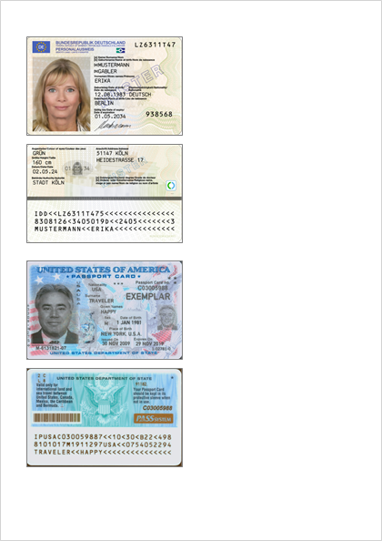
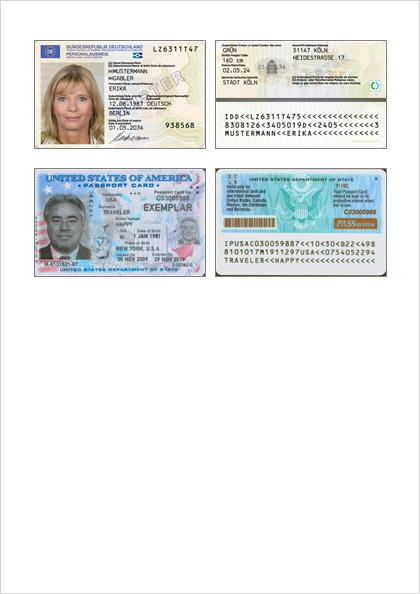

# cardsheet-pdf - Printable A4 PDF Sheets for Card Images

`cardsheet` is a command-line tool designed specifically for preparing printable PDF sheets from images of standard-sized cards.

It is intended for ID cards, membership cards, access badges, and other card‑like images with consistent dimensions.

The tool arranges card images onto an **A4 portrait** page using a clean, predictable layout.

| Default layout | Side-by-side mode |
|----------------|-------------------|
|  |  |

---

## Purpose

The project solves a simple but common problem:  
**take a set of card images (typically JPEGs) and place them onto an A4 sheet in a clean, predictable layout suitable for printing.**

The tool assumes:

- Input images are **JPEG**, **PNG** and **PDF** files (previously created by this tool)
- Images are already in the **correct orientation**
- The output page format is **A4 portrait** (210 × 297 mm)
- Cards are placed in a **grid layout** with configurable spacing

Card dimensions are fixed to real‑world [ID‑1](https://en.wikipedia.org/wiki/ISO/IEC_7810) card size:

- **Width:** 85.6 mm
- **Height:** 53.98 mm

Images are placed into this physical rectangle in the PDF. Print sharpness still depends on the source pixel resolution; use `-dpi` only to cap oversized embedded images.
Images keep their aspect ratio inside the card rectangle.

---

## Layout Modes

### Default layout (stacked vertically)

- Cards are placed **top → bottom**
- When vertical space runs out, a **new column** begins
- Default gaps: vertical alternates **5/10 mm**, horizontal **10 mm**

### Side‑by‑Side Mode

- Always uses **two columns**
- Cards are placed **left → right**, then next row
- Default gaps: horizontal **5 mm**, vertical **10 mm**

---

## Usage

Basic usage:

```
cardsheet image1.jpg image2.jpg
```


### Options

| Option | Description |
|--------|-------------|
| `-dpi <dpi>` | Limit embedded image resolution to this effective DPI |
| `-gap <mm>` | Horizontal spacing; repeat to alternate between columns |
| `-out <file>` | Output PDF file name; defaults to `output.pdf` and overwrites an existing file |
| `-side-by-side` | Force side-by-side layout |
| `-verbose` | Show image DPI and resize information |
| `-version` | Show version and backend |
| `-vgap <mm>` | Vertical spacing |

Input arguments may use shell-style wildcards (`*`, `?`, `[...]`). Wildcard matches are sorted lexicographically.

### Example

```
cardsheet -out cards.pdf -side-by-side card1.jpg card2.jpg
```


This produces an A4 PDF with two cards per row.

### PDF Roundtrip

Generated PDFs store each image's original basename in the image metadata. You can extract those images later:

```sh
cardsheet extract cards.pdf
```

Extraction also works with other PDF files. When source-name metadata is missing, extracted images use fallback names like `cards1.jpg` or `cards2.png`.

Options:

| Option | Behavior |
|--------|----------|
| `--out-dir <dir>` | Write extracted images into a directory |
| `--overwrite` | Replace existing files |
| `--rename` | Write `name-1.ext`, `name-2.ext`, ... on conflicts |

Without either flag, interactive terminals prompt for overwrite, rename, or skip. Non-interactive runs fail with a hint.

---

## Python Version

A Python implementation is also available for quick runs without building the Go binary:

```sh
uv run cardsheet.py -out cards.pdf card1.jpg card2.jpg
```

It supports the same options as the Go CLI.

---

## Build

Build the default Go CLI:

```sh
go build
```

The Go implementation supports multiple PDF backends. Backend-specific build tags and behavior notes are documented in [DEVNOTES.md](DEVNOTES.md).
